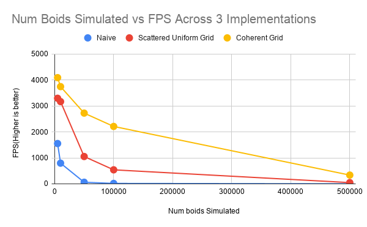
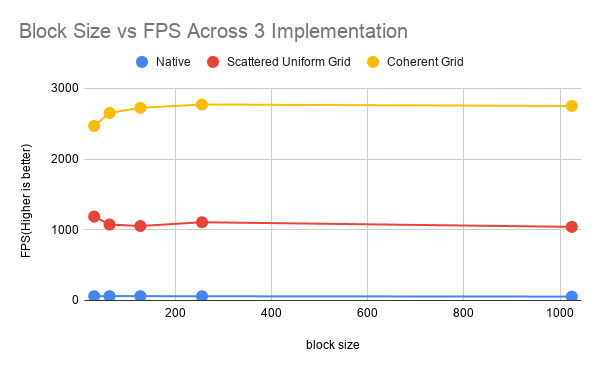
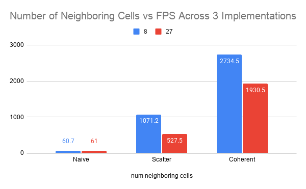

**University of Pennsylvania, CIS 5650: GPU Programming and Architecture,
Project 1 - Flocking**

* Yanfu Ou
  * [LinkedIn]()
* Tested on: (TODO) Windows 22, i7-2222 @ 2.22GHz 22GB, GTX 222 222MB (Moore 2222 Lab)

### (TODO: Your README)
1. gif of the boids demo on top

2. Add your performance analysis. Graphs to include:
  Framerate change with increasing # of boids for naive, scattered uniform grid, and coherent uniform grid (with and without visualization)
#### For each implementation, how does changing the number of boids affect performance? Why do you think this is?

For each implementation, we can see that as the number of boids similated increased, the FPS decreases as well. However, if we take a closer look, we can observe the following interesting phenomon: 
1. For the naive implementation, the FPS initially somewhat dropped proportional to the number of boids simulated. Then after 10,000 boids similated, it drops exponentially as the number of boids similated increased. 

2. For the Scatterred Uniform Grid mplementation, the FPS initially barely dropped as the number of boids doubled from 5000 to 10,000. It then decreased by a third down to 1052.6FPS as the number of boids similated increased by 5 fold. From there, the FPS decreased somewhat proportionally and then exponentially.

3. For the Coherent Grid implementation, the FPS initially dropped very slowly. Until 100,000 boids similated, it then exponentially decreased. 

I think this is due to hitting some sort of bottleneck or constraint unique to each of the implementation. For example, when we compare the Scattered Uniform Grid against the Coherent Grid, we can see that the Scattered Uniform Grid implementation hit a performance bottleneck earlier than Coherent Grid implement, leading its performance to fall off a cliff far earlier than Coherent Grid implementation. One such bottleneck could be the memory lookup speed. The Scattered Uniform Grid implement requires looking up a boid's position and velocity from scattered memory, which would take far more time and leading to a bottleneck. The Coherent Grid implementation make the nearby neighbor boids' position and velocity coherent with the current boid's, allowing for faster memory lookup that adds up over tens of thousands of simulations. 

| Num boids Simulated | Naive  | Scattered Uniform Grid | Coherent Grid |
| ------------------- | ------ | ---------------------- | ------------- |
| 5000                | 1552.2 | 3295.5                 | 4089.6        |
| 10,000              | 796.5  | 3167.2                 | 3744.4        |
| 50,000              | 60.8   | 1052.6                 | 2723.8        |
| 100,000             | 15.9   | 539.5                  | 2210.8        |
| 500,000             | 0.7    | 46.9                   | 336.9         |

#### For each implementation, how does changing the block count and block size affect performance? Why do you think this is?

| block size | Native | Scattered Uniform Grid | Coherent Grid |
| ---------- | ------ | ---------------------- | ------------- |
| 32         | 60.6   | 1185.9                 | 2467.2        |
| 64         | 61.2   | 1073.2                 | 2650.8        |
| 128        | 60.8   | 1052.6                 | 2723.8        |
| 256        | 59.2   | 1105.9                 | 2770.7        |
| 1024       | 54.4   | 1040.4                 | 2749.6        |

#### For the coherent uniform grid: did you experience any performance improvements with the more coherent uniform grid? Was this the outcome you expected? Why or why not?

#### Did changing cell width and checking 27 vs 8 neighboring cells affect performance? Why or why not? Be careful: it is insufficient (and possibly incorrect) to say that 27-cell is slower simply because there are more cells to check!

| num neighboring cells | Naive | Scatter | Coherent |
| --------------------- | ----- | ------- | -------- |
| 8                     | 60.7  | 1071.2  | 2734.5   |
| 27                    | 61    | 527.5   | 1930.5   |

